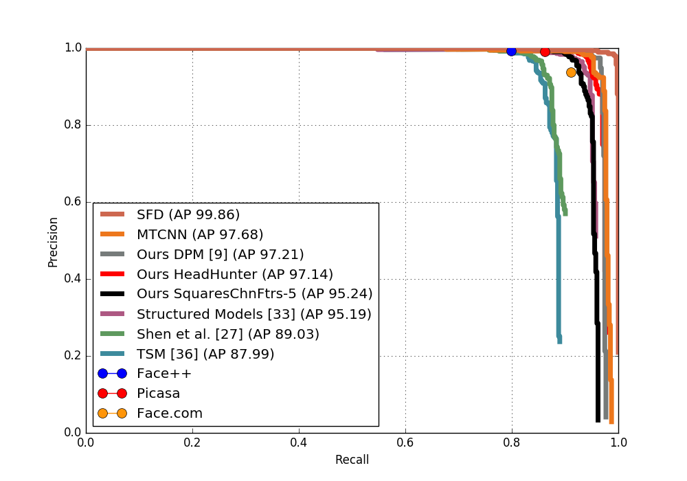
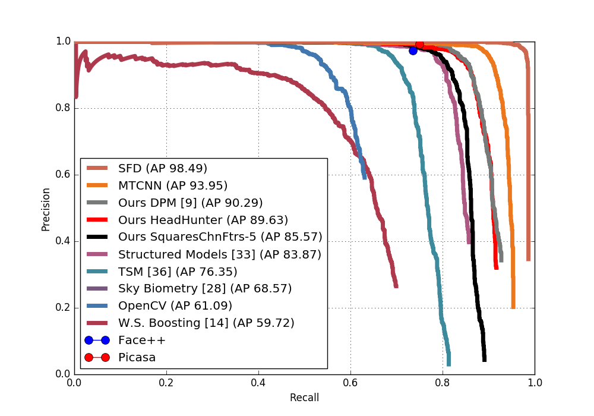
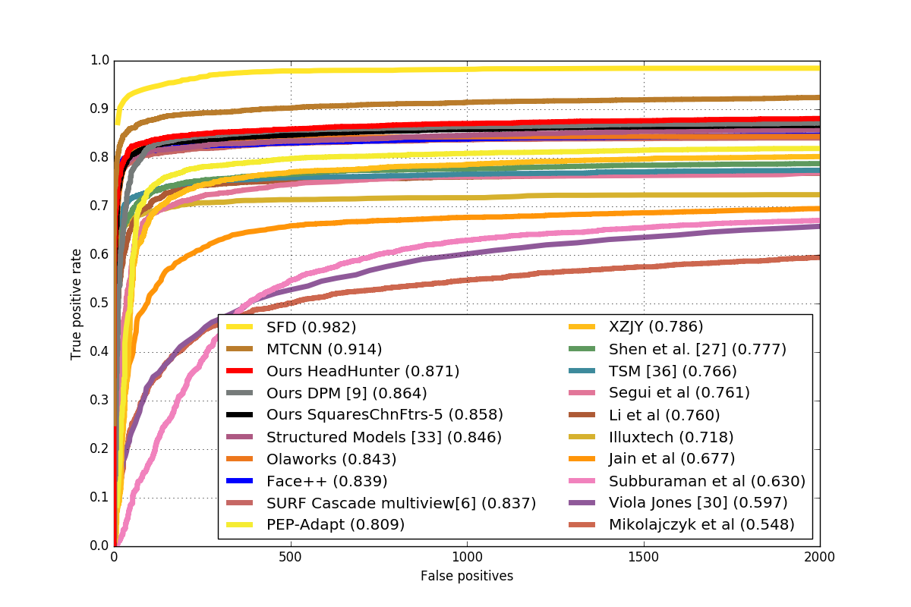

### Comparing SFD and MTCNN

Here we provide SFD and MTCNN([Joint Face Detection and Alignment using Multi-task Cascaded Convolutional Networks](https://kpzhang93.github.io/MTCNN_face_detection_alignment/index.html)) comparision results in three benchmark datasets. 

1. AFW 

2. PASCAL face

3. FDDB

