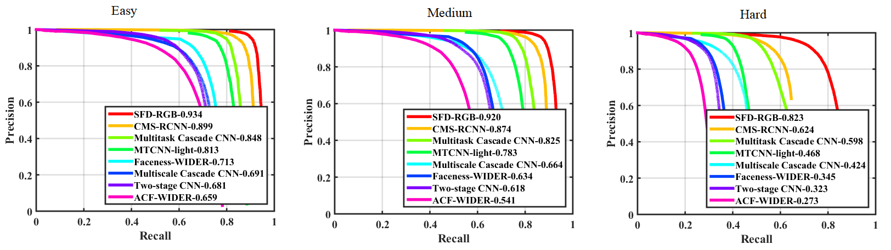

### Comparing SFD and MTCNN

Here we provide SFD and MTCNN-light([Joint Face Detection and Alignment using Multi-task Cascaded Convolutional Networks](https://github.com/AlphaQi/MTCNN-light)) comparision results in four benchmark datasets. 

This version of MTCNN is implemented with no framwroek, it only depends upon C++, OpenCV and Openblas. Therefore it is portable and very easy to use. One of the major adavndatge with input resolution of around 60x480 is it can run in real time in CPU!

1. AFW 

2. PASCAL face

3. FDDB

4. WIDER

