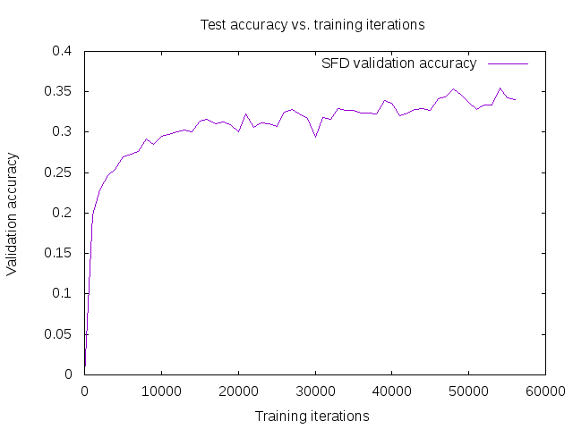
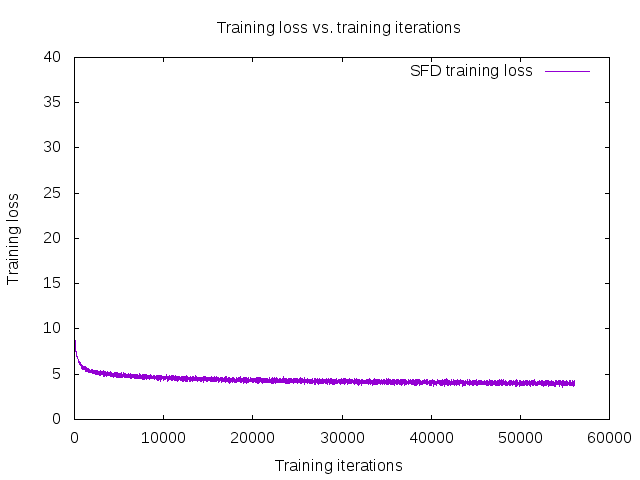

# SFD-MobileNet Train Instructions:

SFD with mobileNet is prepared depending on thid repo: https://github.com/chuanqi305/MobileNet-SSD  
Many modifications are done to adapt the model to SFD, specially the layers used for detection and the data augmentation part.  
TODO: Add all details of the changes in MobileNet model and add the python scripts used with some instructions.  

Doubts about the changes done to the model:
1. They use mean values = 127.5 for the 3 channels, however I used the mean values of ImageNet as done with VGG.  
2. Using the early layer with size 160x160 may not be good choice, as the feature map in this very early stage is different than VGG model.  

Notes: 
1. The training is much slower than SFD-VGG!  
TODO: investigate more about this training speed difference.  

The training loss and validation accuracy of training process is as follows:

