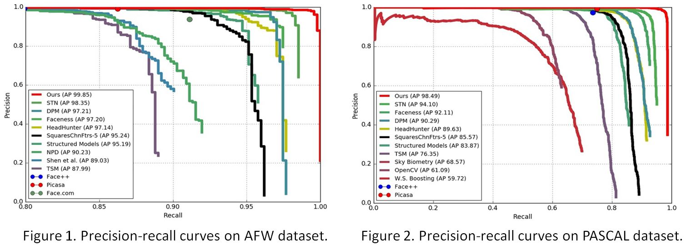
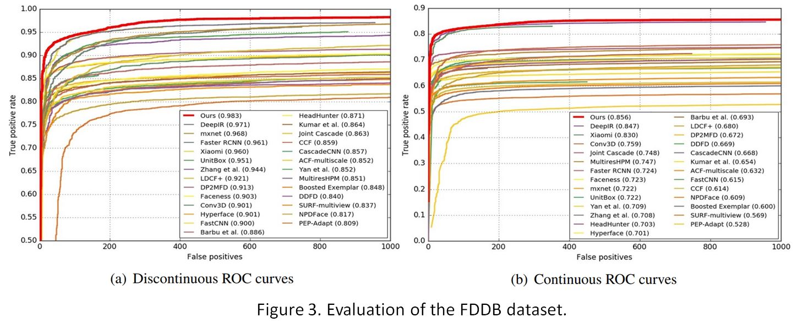

# Test instructions for S³FD: Single Shot Scale-invariant Face Detector

### Introduction

S³FD is a real-time face detector, which performs superiorly on various scales of faces with a single deep neural network, especially for small faces. For more details, please refer to their original [arXiv paper](https://arxiv.org/abs/1708.05237).

### Documentation

1. [Preparation](#preparation)
2. [Download of datasets](#download)
3. [Compile and Run SFD detector](#compilation)
4. [Running evaluation benchmarks](#runningevaluationbenchmark)
5. [Results](#results)
6. [Issues encountered](#issues)

### Preparation

1. To install the proper version of Caffe, follow the [SSD Installation Instructions](./SSD-install.md)

2. Download the authors' [pre-trained model](https://drive.google.com/open?id=1CboBIsjcDQ-FC1rMES6IjTl6sYQDoD6u). To do so, you can run:
    
    ```Shell
    ./scripts/download_model.sh
    ```

    The model will be located in `$CAFFE/models/sfd_models/VGGNet/WIDER_FACE/SFD_trained`.

3. Clone this repository [SFD](https://github.com/bonseyes/SFD) in `$CAFFE/SFD`. Make sure that the folder `$CAFFE/SFD/sfd_test_code` exists.

### Download datasets

To automatically download the datasets, you can execute

```Shell
./scripts/datasets/download_datasets.sh -d desired/path/for/datasets
```

You can also download them manually:
1. [AFW](http://www.ics.uci.edu/~xzhu/face/)
2. [FDDB](http://vis-www.cs.umass.edu/fddb/index.html)
3. [PASCAL face (train/validataion)](http://host.robots.ox.ac.uk/pascal/VOC/voc2012/index.html) and [PASCAL face (test)](http://host.robots.ox.ac.uk:8080/eval/challenges/voc2012/)
4. [WIDER FACE](http://mmlab.ie.cuhk.edu.hk/projects/WIDERFace/)

### Compile and Run SFD detector

1. Compile and Run SFD detector on AFW dataset.
  ```Shell
  cd $CAFFE/SFD/sfd_test_code/AFW
  # You must modify the "Path" in the afw_test.py to your AFW path if it is different then in this tutorial. 
  # It will creat sfd_afw_dets.txt.
  python afw_test.py
  ```
2. Compile and Run SFD detector on PASCAL dataset.
  ```Shell
  cd $CAFFE/SFD/sfd_test_code/PASCAL_FACE
  # You must modify the "Path" in the pascal_test.py to your PASCAL_face path if it is different then in this tutorial. 
  # It will creat sfd_pascal_dets.txt.
  python pascal_test.py
  ```
3. Compile and Run SFD detector on FDDB dataset.
  ```Shell
  cd $SFD_ROOT/sfd_test_code/FDDB
  # You must modify the "Path" in the fddb_test.py to your FDDB path if it is different then in this tutorial.
  # It will creat sfd_fddb_dets.txt.
  python fddb_test.py
  # Fitting the dets from rectangle box to ellipse box.
  # It will creat sfd_fddb_dets_fit.txt and put it in the FDDB evalution code to evalute.
  cd fddb_from_rectangle_to_ellipse
  matlab -nodesktop -nosplash -nojvm -r "run fitting.m;quit;"
  # If you want to get the results of FDDB in our paper, you should use our 'FDDB_annotation_ellipseList_new.txt'
  ```

4. Compile and Run SFD detector on WIDER FACE dataset.
  ```Shell
  cd $SFD_ROOT/sfd_test_code/WIDER_FACE
  # You must modify the path in the wider_test.py to your WIDERFACE path. 
  # It will create detection results in the "eval_tools_old-version" folder.
  python wider_test.py
  # If you want to get the results of val set in our paper, you should use the provided "eval_tools_old-version". 
  # Or you can use latest eval_tools of WIDER FACE.
  # There is a slight difference between them, since the annotation used for the evaluation is slightly change around March 2017.
  ```
### Running evaluation benchmarks

Download the [EVALUATION TOOLBOX](https://bitbucket.org/marcopede/face-eval) for evaluation. We call this directory `$CAFFE/SFD/face-eval`.

1. Evaluate our model on AFW dataset.
```Shell
# Put sfd_afw_dets.txt from `$CAFFE/SFD/sfd_test_code/AFW` to `$CAFFE/SFD/face-eval/detections/AFW`.
cd $CAFFE/SFD/face-eval
python plot_AP.py --dataset AFW
# The final evaulation ROC graph will be stored in `$CAFFE/SFD/face-eval/`.
```
2. Evaluate our model on PASCAL face dataset
```Shell
# Put sfd_pascal_dets.txt from `$CAFFE/SFD/sfd_test_code/PASCAL_face` to `$CAFFE/SFD/face-eval/detections/PASCAL`
cd $CAFFE/SFD/face-eval
python plot_AP.py 
# The final evaluation ROC graph will be stored in `$CAFFE/SFD/face-eval/.
```

### Reproduced Results
1. AFW 

2. PASCAL face


#### Reference (results from original paper)





### Issues encountered

#### 1. While testing on pascal dataset, some images listed in "sfd_test_code/PASCAL_face/pascal_img_list.txt" are not found.
    I used PASCAL dataset from VOCtrainval_11-May-2012.tar (VOCdevkit/VOC2012/JPEGImages).
    for example "2008_000216.jpg" image in pascal_img_list.txt is not in dataset. <br />

    Solution: Mix training-validation dataset with test dataset from pascal 2012 cahallenge. After mixing [training/validation data](http://host.robots.ox.ac.uk/pascal/VOC/voc2012/index.html) with [test data](http://host.robots.ox.ac.uk:8080/eval/challenges/voc2012/), all the pascal images listed in "sfd_test_code/PASCAL_face/pascal_img_list.txt" are available in merged folder. 
    This is now done automatically by the dataset downloading scripts.

#### 2. After the AFW/PASCAL dataset evaluation of our detector and other detector present in EVALUATION TOOLBOX, the result of SFD detector is not as expected.
    Seems something wrong as ROC curve of our detector is very poor. <br />
    Solution: Fixed. The detection result in AFW dataset is now exactly same as in the original paper. It was because of wrong linkag e of deploy.prototxt! <br />

#### 3. The detection result in PASCAL face is 97.60% where as in original paper it is 98.49%
    Solution: Using the correct version of Python and recompiling Caffe got PASCAL-face to 98.49
