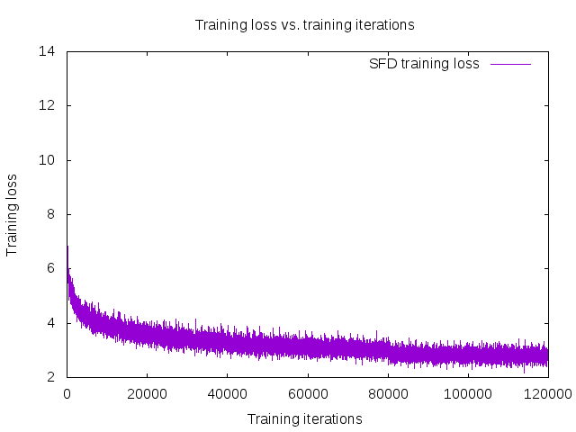
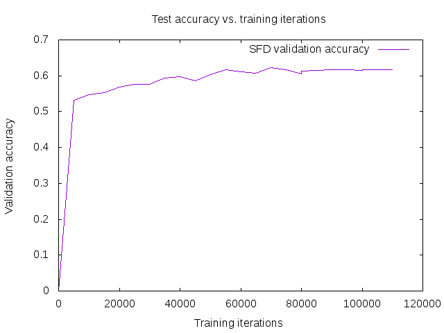
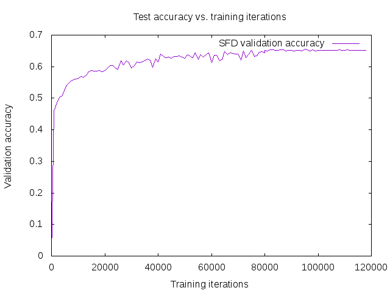

# Train Instructions:

- Setup of training machine on Amazon   
-> Version of AMI (Deep Learning Base AMI (Ubuntu) Version 3.0 (ami-07c2a77e)   
-> Version of Amazon Instance > p3.2xlarge   

- SSD installation steps and notes can be found in the directory: docs/SSD-install.md, Make sure to include $CAFFE_ROOT/python to your PYTHONPATH

1. Follow the intruction of SSD to create the lmdb of WIDER FACE. [DONE]   

-> To start with wider face dataset, first we need to download it. If you work on server, you will face problem to download the data from google drive directly to the server. Therefore, in the "scripts" folder in this repo, we use the scripts "download-data.sh" and "google-drive.py" to solve this problem. Just put these scripts in the directory: $HOME/data, then run the script like this: ./download-data.sh. the data will be downloaded and unziped.   

-> Useful link: https://github.com/weiliu89/caffe/wiki/Train-SSD-on-custom-dataset  
- To prepare the data and genearte lmdb database, next steps are done:  
 1- prepared script to modify annotations as required for lmdb and put them in seperate files: The annotations should be in the format: "label_id xmin ymin xmax ymax" and exist inside text files with the same names as their corresponding images, these files contain all bounding boxes in the annotations related to this image. This script exists in the scripts/ folder with the name "generate-train-annotations.py". We need to run this script twice, one for training and one for validation set, in each time just uncomment the corresponding lines in the script.   

 2- prepared script to put each image with the corresponding annotation file, and list all of them in one text file. This script take the directories of the files generated from previous step, and the directory of the images, then it generate the list. The script exists in the scripts folder under the name "generate-lists.py". We need to run it twice as previous step, in each time uncomment the necessary lines. The output of this step should be in $SSD_ROOT/data/WIDER_FACE, which contans "train.txt", "val.txt", and "val_name_size.txt"   

 3- modified the lmdb script "$SSD_ROOT/data/WIDER_FACE/create_data.sh" in SSD to make it accept txt annotations files not json or xml files. Then run this script which generated the lmdb database susccessfully in $HOME/data/WIDER_FACE   

 4- prepared the file "labelmap_wider.prototxt" which contains the labels of the training and testing, 0 is background and 1 is face.   

2. Modify the data augmentation code of SSD to make sure that it does not change the image ratio.
(Detail these steps here including which source files and what lines of code)  [DONE]  
-> [DONE] The augmentation strategy in the paper of SFD is followed, and the image ratio is not changing. The details of this part is implemented in the python script for training, it can also be found at the beginning of train.prototxt file.    
-> If you use the python script for training, you need one modification. In the file $CAFEE_ROOT/python/caffe/model_libs.py Change part of the function "VGGNetBody" in line 391 to be as follows "net[name] = L.Pooling(net.relu5_3, pool=P.Pooling.MAX, kernel_size=2, stride=2)"  

3. Modify the anchor match code of SSD to implement the 'scale compensation anchor matching strategy'.
(Detail these steps here including which source files and what lines of code)  [DONE]  

-> [DONE] modify the 'MatchBBox' function in bbox_util.cpp by adding extra stage to implement the stage 2 of anchor matching strategy. This part is added in the file bbox_util.cpp inside SSD code. The modified file will be attached with the final SSD code. After this modification, caffe should be recombiled again.  

4. Train the model.
(Provide train script including amount of training time and validation loss curves and anything else useful) [DONE]  

-> [DONE] Prepare python script following SSD style that will include defining anchor boxes scales, stride, used VGG layers, augmentaion, and the paths to the genearted logs. Then start training by runing the python script.   
-> [DONE] Check training details from the paper (learning rate, max iterations, etc)   
-> [DONE] Generate tarining loss and validation loss graphs after training is finished.   

Training is done, with 120K iterations as noted in the SFD paper, it starts by learning rate of 0.001 for first 80K iteration, then 0.0001 for next 20K iteration, and finally 0.00001 for last 20K iterations. Batch size used is 32, as this is much data to fit in one GPU, Caffe allows to use smaller batch size of 8, then accumulated batch size of 32, which means that Caffe calculate the loss for batch size of 8 four times, then do the backpropagation once after it accumulates all the losses, This helps a lot as the GPU memory doesn't fit batch size of 32. Training takes long time, it almost took 1 day for 20K iteartions, this is mainly because some processing like data augmentation is done using CPU, in addition to the bottleneck of transfering data from the hard disk to GPU RAM. Therefore, the training with 120K took around 5 days and a half. some people also reported that training is slow: https://github.com/sfzhang15/SFD/issues/16   

an accuracy test for validation set is done each 5K itertions, in the future decrease this number to test each 1K or 2K iterations to follow the training in better way and get a more smoother validation accuracy curve. The scripts to plot training loss and test accuracy can be found in the path 'scripts/train/plot_train_graphs' these scripts work by modifying each of them to read the required training and validation files, so start by the script "generate_plots_SFD.sh" and inside it modify the path to the logs genearted by your code during training (.log file), this will genearte 2 files ends with .log.test and .log.train, we use gnuplot tool to plot the curves from these generated files. To prepare this we prepare 2 files end with .gnuplot, one for training and one for testing for example in our case we have "plot_log_SFD_training.gnuplot" and "plot_log_SFD_val.gnuplot" for training and validation respectively. Inside each of these .gnuplot files, you can modify the name of the files used to generate the plots, in addition to the name of the generated png image, etc. By modifying these scripts and running ./generate_plots_SFD.sh all files will be generated and will be found in the same path you run from, note that these scripts should be exist in the directory $CAFFE_ROOT/tools/extra and should be run from this directory.  

Training Plots of training loss vs. iterations, and validation accuracy vs. iterations are as follows:

I think these numbers in validation accuracy are low, but since we don't use the mevaluation metric as used in the paper we cannot confirm this, so we are waiting for the results from our test codes.  
The model after training can be found here: https://drive.google.com/drive/folders/1WbTmDlUst-90lB8NC_KtcE11v49wW7W2?usp=sharing  

# Notes about training process:  
-> In the .prototxt files provided by the authors, there is no test.prototxt file, and in the solver.prototxt they don't use it, which simply means that they didn't use validation accuracy from caffe while training. However, in our case, using the python script we generate and use this test.prototxt file and get validation accuracy during training. This can mean that they don't use validation set and just trained blindly, or they took snapshots and used other evaluation code for validation, note that they were taking snapshots each 5000 iterations.  
-> Second thing is that in the provided files by authors it seems they use batch size of 8 not 32 as they say in the paper, for me I used batch size of 8 four times as explained above.  
-> Another difference in training that they don't mention in the paper is excluding tiny faces! I am not sure how far this can affect the results, refer to this issue for more details, and see last cooment by the author: https://github.com/sfzhang15/SFD/issues/7  
-> We need to inverstigate more about data augmentation, it seems it should not only change from python or .prototxt, but also from cpp files (may be SampleBBox function in bbox_utils.cpp). What is not obvious here is that they already resize the image to 640x640 at the beginning of the training, which itsef change the original image size and faces inside the image. I made an issue in the original repo and waiting for the reply of the author: https://github.com/sfzhang15/SFD/issues/20. Look at this issue for more info: https://github.com/sfzhang15/SFD/issues/6  
-> There are other implementation using pytorch, we can see how they implemented these details and follow their steps: https://github.com/clcarwin/SFD_pytorch  

# Run the training in the server

When the training script is run in the server, it will quit if we closed the terminal or if the internet is cut. To solve this we use the command "screen" as follows:  
After you ssh in, run screen. This will start another shell running within screen. Run your command, then do a "Ctrl-a-d". This will "disconnect" you from the screen session. At this point, you can log out or do anything else you'd like. When you want to re-connect to the screen session, just run "screen -RD" from the shell prompt.
more commands can be found here: http://aperiodic.net/screen/quick_reference
