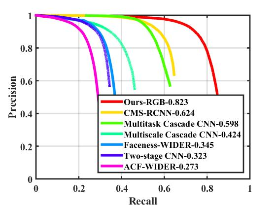

# Results for of SFD on WIDER_FACE dataset
1. Results of original model
The results of validation set using the original model provided by the authors are as follows:  
Easy subset = 93.9%     
Medium subset = 92.2%   
Hard subset = 83.4%     
These results are slightly lower than the results in table 3 of SFD paper. in the paper easy subset = 93.7%  , medium subset = 92.4 , and hard subset = 85.2  
We notice that the results we got for easy subset is actually better than the paper, but for medium and hard it is worse, the difference is big in hard subset 85.2 in the paper vs. 83.4 in our evaluation. 

2. Results of trained model
The results of validation set using the trained model (explained in training documentation) are as follows:  
Easy subset = 93.3%     
Medium subset = 92.0%   
Hard subset = 82.3%     
We can see that the results is comparable with the original model, mAP of hard subset is less than original model by 1.1% only.  

3. Results of trained model with RGB, and tested with validation set in grayscale:  
Easy subset = 91.0%     
Medium subset = 87.9%   
Hard subset = 73.2%     

To summarize the comparison, the results of original model (tested by our codes) and the trained model is as follows:  

| subset   | Easy  | Medium | Hard  |
|----------|-------|--------|-------|
| Original | 93.9% | 92.2%  | 83.4% |
| Trained  | 93.3% | 92.0%  | 82.3% |
| grayscale input  | 91.0% | 87.9%  | 73.2% |

