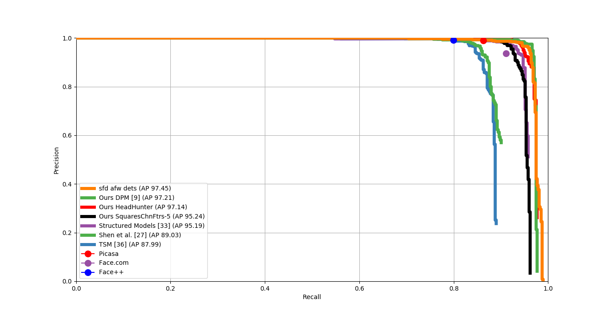
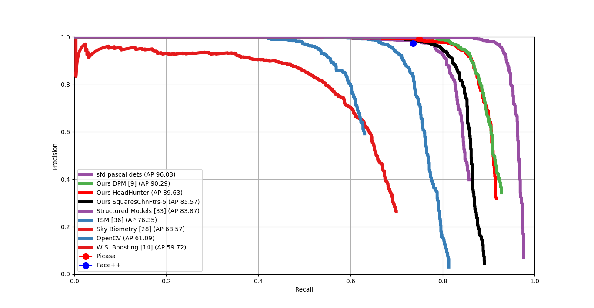

# SFD-320x320-3CH-ResNetV1-CaffeSSD-Float32-Dense Model

__Input__
+ 320x320
+ 3 channels RGB

__Architecture__
+ MobileNet-V1
+ [MobileNetV1 Architecture - Pretrained Model COCO](https://drive.google.com/open?id=0B3gersZ2cHIxVFI1Rjd5aDgwOG8)
+ Features Layers : conv3, conv5, conv11, conv13, conv14_2, conv15_2

__Training__
+ Caffe SSD
+ Float32
+ Dense
+ Mean values: [104, 117, 123]

__Files__
+ [deploy](deploy.prototxt)
+ [train](train.prototxt)
+ [test](test.prototxt)
+ [trained model](https://drive.google.com/open?id=1nrcekK5sLOUL3zVCzBaORwZTKw6mXnxM)

__Results WIDERFACE[120K iterations]__
+ Easy: 84.3
+ Medium: 79.1
+ hard: 55.3%

__Notes__
 The performance is less than 640x640 by ~4%, except for hard subset it is better by ~5%

__Results AFW__

__Results PASCAL__

