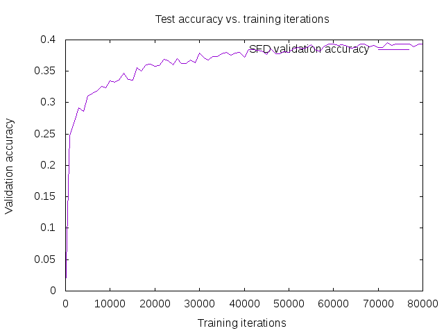

# SFD-320x320-3CH-MobileNetV2-mod1-CaffeSSD-Float32-Dense Model

__Input__
+ 640x640
+ 3 channels RGB

__Architecture__
+ MobileNet-V2
+ [MobileNetV2 Architecture - Pretrained Model_with_ImageNet]() 
+ Features Layers : conv_13/expand, Conv_1, layer_19_2_2, layer_19_2_3, layer_19_2_4

__Training__
+ Caffe SSD
+ Float32
+ Dense
+ Mean values: [104, 117, 123]

__Files__
+ [deploy](deploy.prototxt)
+ [train](train.prototxt)
+ [test](test.prototxt)
+ [trained model 90K iterations](https://drive.google.com/drive/folders/1mbs_u8to4bPycUk2coUiXuXb-IduT5EW?usp=sharing)

__Results[90K iterations]__
+ Easy: 90.4%
+ Medium: 88.8%
+ hard: 78.5%

##### Training
+ Training batch size = 32. For this model it is important to have big batch size as it extensively use batch norm, this can explain the weired behavior of the validation accuracy curve in previous model (640x640)
+ To solve the memory issue, these files need to be replaced in Caffe src/caffe/layers with these [files](https://github.com/chuanqi305/MobileNetv2-SSDLite/tree/master/src). Don't forget to rebuild caffe again. 
+ To start training, the learning rate needs to be very small, otherwise the fluctuations in training loss and validation accuracy will be very big. I found that learning rate 0.00004 is the best depending on my observations, this lr further decreases 60K and 80K iterations. 
+ The validation accuracy while training is as follows: 

##### Testing
+ For testing, you should first modify the files in the src/ folder as explained in training notes. This should decrease the memory usage. After that, the testing should be done as usual.
+ I tested the model for WIDERA_FACE, but faced "out of memory" issue after event:25 num:3. Note that we use GPU with 16GB of RAM! I have investigated about this problem and found the problem in image WIDER_val/images/30--Surgeons/30_Surgeons_Surgeons_30_819.jpg. The problem was the height of the image is 218, so it seems there was a problem if the image is smaller than input size. So the problem is solved after resizing the image to bigger size (increasing the height of the image to 800).   
