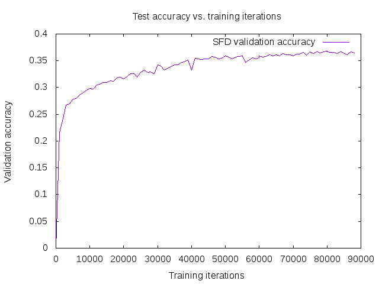

# SFD-320x320-3CH-MobileNetV2-mod2-CaffeSSD-Float32-Dense Model

__Input__
+ 320x320
+ 3 channels RGB

__Architecture__
+ MobileNet-V2
+ [MobileNetV2-mod2 Architecture - Pretrained with ImageNet]() 
+ Features Layers : conv_13/expand_, Conv_1, layer_19_2_2, layer_19_2_3, layer_19_2_4

__Training__
+ Caffe SSD
+ Float32
+ Dense
+ Mean values: [104, 117, 123]

__Files__
+ [deploy](deploy.prototxt)
+ [train](train.prototxt)
+ [test](test.prototxt)
+ [trained model](https://drive.google.com/drive/folders/1b7Li9CMw-okHEC34XITpP5h8pLYfpgqR?usp=sharing)

__Results__
+ Easy: 89.8%
+ Medium: 87.7%
+ hard: 75.4%

### Notes

##### Training
+ The main difference between this version and original one is using stride=2 for conv_1 and stride=1 for conv_3. This modifications decrease the sizeof the conv layers at conv_1 which decreased the memory usage. The second modification is decreasing the expansion ratio to 3 (It was originally 6). 
+ Now a batch size of 16 images with iter_size=2 is used, so that at the end the training is done with batch size = 32. Note that the extensive usage of BN layers in the model requires batch size to be big enough, otherwise, more fluctuations in training loss and validation accuracy will happen.  
+ To solve the memory issue, these files need to be replaced in Caffe src/caffe/layers with these [files](https://github.com/chuanqi305/MobileNetv2-SSDLite/tree/master/src). Don't forget to rebuild caffe again. 
+ To start training, the learning rate needs to be very small. I found that learning rate 0.00004 is the best, then it is decreased after 60K and 80K iterations.

##### Testing
+ For testing, you should first modify the files in the src/ folder as explained in training notes. This should decrease the memory usage. After that, the testing should be done as usual.
 
