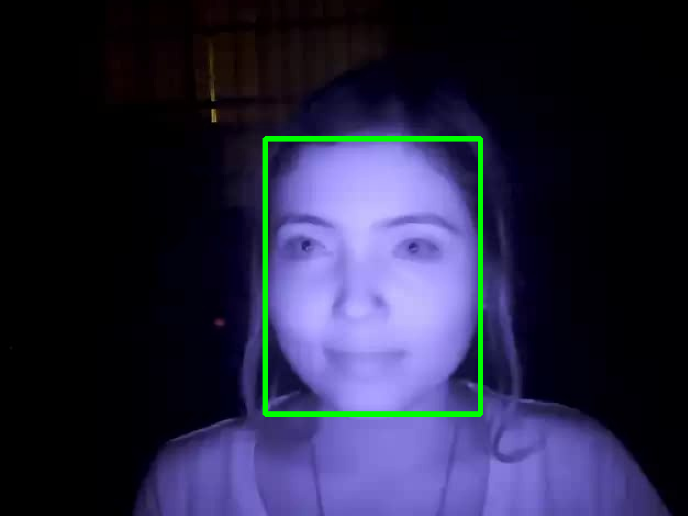

# Instructions

Automatically annotate face bounding boxes using PyramidBox CNN face detector on directory of images.

1. Download model weights file model here : https://drive.google.com/open?id=1rXwlqaWaTgsFcNaNlp9GE2Vxq4_G6Zge and place into path : ./weights/Res50_pyramid.pth

2. Download and convert videos as described in example dataset: datasets\nirfaces\videos\README.txt

3. Run process_dataset.py on extracted frames from videos (with or without CUDA)

~~~
python process_dataset.py --image_dir datasets/nirfaces/images --out_dir datasets/nirfaces/annotations --no-cuda --no-imshow
~~~

# Annotation Output

The output annotation for each image is stored in a txt file in widerface format:

~~~
datasets/nirfaces/images/Sub10_frame_0.jpg
1
249.3 135.1 196.8 252.4 1.000
~~~

# Example Bounding Box Output

