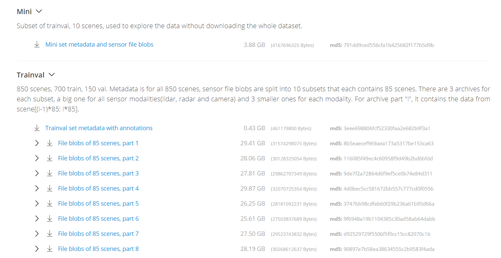

# NUSCENES Camera Dataset Download and using Instructions
Here we describe how to download NUSCENES camera only datasets. We also provide easy python script to show how to split data into train/val set, how to use specific version among "v1.0-trainval", "v1.0-test", "v1.0-mini" and how to get annotation such as 3d bounding box and labels. 

## Dataset download
Use script below to download nuscenes camera only dataset and annotations into folder `SFD/NUSCENES_DATA_ROOT/NUSCENES`. It will download all three versions of dataset and unzip it. 

```
cd SFD 
./script/data/nuscenes/download_nuscenes.sh NUSCENES_DATA_ROOT
```

## How to use?
In `SFD/script/data/nuscenes/` dir you can see `nuscenes_nviso.py` and `test.py` python script. These are simple use case script showing easy way to use nuscenes devkit. Before you use this script, you need to install nuscenes devkit using pip [for detailed instructions click [here](https://github.com/nutonomy/nuscenes-devkit#devkit-setup)] as follows. 

```
pip install nuscenes-devkit
```

Now you can run `test.py` script. By default it will load `v1.0-mini` version with `CAM_FRONT` images, display val_scenes and draws the bounding box in it. You need to provide dataroot args to tell the path of nuscenes dataset you have downloaded. In our case we have downloaded in `SFD/NUSCENES_DATA_ROOT/NUSCENES` folder. 

```
SFD_ROOT=$(pwd)
cd script/data/nuscenes/
python test.py dataroot="$SFD_ROOT/NUSCENES_DATA_ROOT/NUSCENES/NUSCENES_MINI_DATASET_ROOT"
```

Similarly if you want to use "v1.0-trainval" version with "CAM_BACK" token you can execute following command

```
SFD_ROOT=$(pwd)
cd script/data/nuscenes/
python test.py dataroot="$SFD_ROOT/NUSCENES_DATA_ROOT/NUSCENES/NUSCENES_TRAINVAL_DATASET_ROOT" version="v1.0-trainval" token="CAM_BACK"
```

# NUSCENES Full Dataset Download Instructions

## About nuScenes [https://www.nuscenes.org/]
The nuScenes dataset is a large-scale autonomous driving dataset.  

## Devkit setup
The nuScenes dataset devkit is available at [https://github.com/nutonomy/nuscenes-devkit](https://github.com/nutonomy/nuscenes-devkit).  
The devkit is tested for Python 3.6 and Python 3.7. Devkit is available and can be installed via pip:  
```
pip install nuscenes-devkit
```
For an advanced installation, see [installation](https://github.com/nutonomy/nuscenes-devkit/blob/master/setup/installation.md) for detailed instructions.

## Dataset download
To download nuScenes you need to go to the [Download page](https://www.nuscenes.org/download), create an account and agree to the nuScenes [Terms of Use](https://www.nuscenes.org/terms-of-use).

Step 1: Click [Sign Up](https://www.nuscenes.org/sign-up)
Step 2: Complete the form and login with your ID and PASS you have just created. 
Step 3: Now you can download the subset of dataset that you are interested in.  
  

  
For the devkit to work you will need to download all archives. Please unpack the archives to the /data/sets/nuscenes folder *without* overwriting folders that occur in multiple archives. Eventually you should have the following folder structure:

```
/data/sets/nuscenes
    samples	-	Sensor data for keyframes.
    sweeps	-	Sensor data for intermediate frames.
    maps	-	Large image files (~500 Gigapixel) that depict the drivable surface and sidewalks in the scene.
    v1.0-*	-	JSON tables that include all the meta data and annotations. Each split (trainval, test, mini) is provided in a separate folder.
```