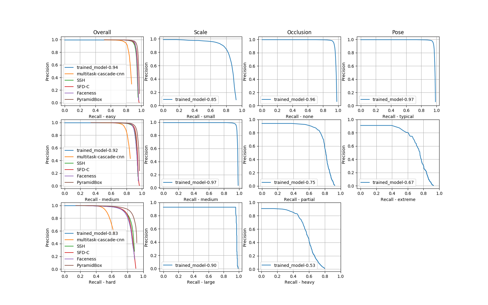

## Getting WIDERFace mAP

For easy, medium and hard sets:

```
# Example:
python2.7 wider_eval.py -p ../output/WIDER_FACE/eval_tools/pred_orig -m ../output/WIDER_FACE/eval_tools/ground_truth/wider_easy_val.mat
```

Where `-p` is where the outputs of `test_wider.py` are and `-m` is where the groundtruth file is (can be `easy`, `medium` or `hard`). 

Run `wider_eval.py -h` for a help message.

## Plotting WIDERFace metrics by categories

To evaluate metrics for all the categories for which WIDER can be split (Overall, Scale, Occlusion and Pose):

```
python2.7 plot_wider.py -p /path/where/predicted/bboxes/are -m /path/where/groundtruth/mat/files/are -b /path/where/other/models/baselines/are

# Example
python2.7 plot_wider.py -p ../output/WIDER_FACE/eval_tools/pred_orig -m ../output/WIDER_FACE/eval_tools/ground_truth -b ../output/WIDER_FACE/eval_tools/plot/baselines/Val/setting_in
```

Currently, the script compares the trained model on the Overall split against the following baselines: `PyramidBox`, `SFD-C`, `multitask-cascade-cnn`, `Faceness` and `SSH`.
Most of them are already included in the [`eval_tools`](http://mmlab.ie.cuhk.edu.hk/projects/WIDERFace/support/eval_script/eval_tools.zip) provided by WIDER. However, `PyramidBox` and `SFD-C` have to be downloaded separately and put inside `eval_tools/plot/baselines/Val/setting_int`.
Those missing baselines can be found [here](http://mmlab.ie.cuhk.edu.hk/projects/WIDERFace/WiderFace_Results.html) (search for the `Val PR curves` links).

The scripts takes the following arguments:

```
-p  A folder where all the _TESTED_ models' outputs are. The structure of the folder should be like:
    .
    +-- _Original
    |   +-- 0--Parade 
    |   +-- 10--People_Marching
    |   +-- etc
    +-- _SFD-640x640-1CH-VGG-CaffeSSD-Float32-Dense_iter_120000
    |   +-- 0--Parade 
    |   +-- 10--People_Marching
    |   +-- etc
    +-- _SFD-640x640-3CH-VGG-CaffeSSD-Float32-Dense
    |   +-- 0--Parade 
    |   +-- 10--People_Marching
    |   +-- etc

    The important thing is that each model should have its own separate folder with its corresponding detections (and the name of the folder should respect the ones in [here](../../models/README.md)

-m  Folder where the groundtruth labels in .mat format are. This labels come with the eval_tools provided by WIDER homepage

-b  Folder where the other models baselines are. This folder also comes with the eval_tools provided by WIDER homepage.
```

Example:
```
python2.7 plot_wider.py -p ../tests_output/ -m ../output/WIDER_FACE/eval_tools/ground_truth -b ../output/WIDER_FACE/eval_tools/plot/baselines/Val/setting_int
```

Read the subsection "Test SFD on WIDER FACE" [here](../../docs/Test-Instructions.md) for more details on how to create the folder required for the parameter `-p`.

The resulting plot should look like this:


