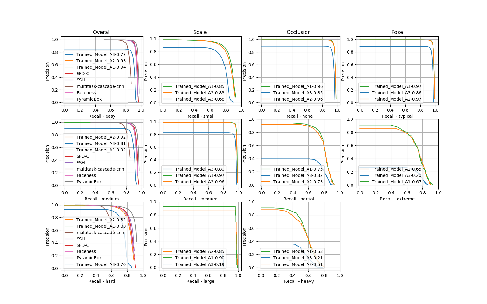

## Getting WIDERFace mAP

For easy, medium and hard sets:

```
# Example:
python2.7 wider_eval.py -p ../output/WIDER_FACE/eval_tools/pred_orig -m ../output/WIDER_FACE/eval_tools/ground_truth/wider_easy_val.mat
```

Where `-p` is where the outputs of `test_wider.py` are and `-m` is where the groundtruth file is (can be `easy`, `medium` or `hard`). 

Run `wider_eval.py -h` for a help message.

## Plotting WIDERFace metrics by categories

To evaluate metrics for all the categories for which WIDER can be split (Overall, Scale, Occlusion and Pose):

```
python2.7 plot_wider.py -p /path/where/predicted/bboxes/are -m /path/where/groundtruth/mat/files/are -b /path/where/other/models/baselines/are

# Example
python2.7 plot_wider.py -p ../output/WIDER_FACE/eval_tools/pred_orig -m ../output/WIDER_FACE/eval_tools/ground_truth -b ../output/WIDER_FACE/eval_tools/plot/baselines/Val/setting_in
```

Currently, the script compares the trained model on the Overall split against the following baselines: PyramidBox, SFD-C, multitask-cascade-cnn, Faceness and SSH.
Those baselines can be found [here](http://mmlab.ie.cuhk.edu.hk/projects/WIDERFace/WiderFace_Results.html) (search for the `Val PR curves`).
Most of them are already included in the `eval_tools` provided by WIDER. However, PyramidBox and SFD-C have to be downloaded separately and put inside `eval_tools/plot/baselines/Val/setting_int`.

The resulting plot is like this:


